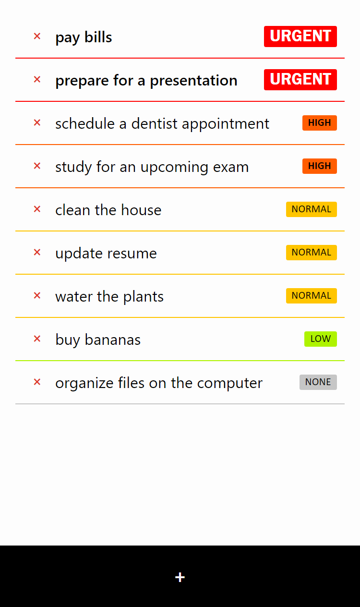

<h1 align="center"><strong>todo</strong></h1>

intuitive web-based app for organizing your tasks
 
<a href="https://paulinek13.github.io/todo/"><strong>paulinek13.github.io/todo</strong></a>
 
 
<a href="https://github.com/paulinek13/todo/issues">request feature · report issue</a>
 
<a href="#about">about</a> ·
<a href="#features">features</a> ·
<a href="#technologies">technologies</a> ·
<a href="#roadmap">roadmap</a> ·
<a href="#contributing">contributing</a>
 
 

# About

User-friendly and useful PWA **_todo_** app. Designed with mobile devices in mind. Works offline once installed. Saves all the data locally (indexedDB).

# Features

- adding a task and its priority
- deleting a task
- listing tasks by priority (from highest to lowest)

# Technologies

- Vanilla JS
- [Dexie.js](https://github.com/dexie/Dexie.js)

# Roadmap

- [ ] add a way to sort tasks by different things
- [ ] dark mode

# Contributing

Pull requests are welcome. _Any_ feedback is welcome as well.
For major changes, please open an issue first to discuss what you would like to change.